<a href="https://jmoraispk.github.io/odysseus-fx/">
  
</a>

<p align="center">
  <a href="https://jmoraispk.github.io/odysseus-fx/"></a>
  
  
  <a href="LICENSE"></a>
</p>

<h1 align="center">Odysseus FX</h1>

<p align="center">
  <b>25 live, interactive visual effects in a single HTML file.</b><br>
  Flow fields, reaction–diffusion, metaballs, boids, raymarched shaders — all running, none of them screenshots.
</p>

<p align="center">
  <a href="https://jmoraispk.github.io/odysseus-fx/"><b>→ Open the gallery ←</b></a>
</p>

---

## See it move

The banner above is an animated SVG, so it plays right here in the README. But that's only a taste — GitHub strips JavaScript, so the *real* effects (live `<canvas>` and WebGL) can only run in a browser:

### **[jmoraispk.github.io/odysseus-fx](https://jmoraispk.github.io/odysseus-fx/)**

Hover, drag, and poke everything. Orbit the raymarcher, paint into the falling sand and Game of Life, click to drop ripples and launch fireworks, drag to steer the Julia constant. Flip the theme (top-right) and watch all 25 effects recolor at once.

---

## What's inside

One file — [`index.html`](index.html) — holds a tiny framework and 25 self-registering effects. Each tile shows its rank, a one-line "the trick" explanation, and a *view the key idea in code* expander.

### Category A — vanilla · no dependencies (18)
Pure Canvas 2D and plain JavaScript. Ranked by how good the trick-to-code ratio is.

| # | Effect | The trick |
|---|--------|-----------|
| 1 | Flow field | Particles read an angle from a noise field; trails are a faint fill, not a clear |
| 2 | Reaction–diffusion | Two chemicals diffuse and react via a 5-point Laplacian (Gray–Scott) |
| 3 | Metaballs | Sum r²/distance²; threshold the field into fused liquid metal |
| 4 | Boids | Separate, align, cohere — a flock emerges with no leader |
| 5 | Falling sand | Each cell falls down, else slides diagonally; water spreads sideways |
| 6 | Julia set | Iterate z ← z² + c per pixel; move c on a circle and it breathes |
| 7 | Plasma | Sum a few sines of x, y, x+y, radius → shifting palette |
| 8 | Tixy field | A 16×16 dot grid driven by one tiny formula f(t,i,x,y) |
| 9 | Digital rain | One falling glyph per column, brighter at the head |
| 10 | Starfield warp | Shrink each star's z and project with perspective |
| 11 | Conway's Life | Survive on 2–3, born on 3 — gliders from one rule |
| 12 | Water ripple | Height field: neighbour-average minus old, then damp; shade by slope |
| 13 | Fireworks | Particle system: emit, gravity, fade; additive blend = glow |
| 14 | Spectrum bars | AnalyserNode frequency bins → bars (optional mic) |
| 15 | Dither | Floyd–Steinberg: snap to palette, push the error to neighbours |
| 16 | Harmonograph | Two damped perpendicular sinusoids trace a pen |
| 17 | Constellation | Dots joined by lines that fade with distance; the cursor is a node |
| 18 | Sine dot grid | Dot radius = sine of distance to a moving centre |

### Category B — GPU & libraries (7)
Raw WebGL shaders, plus two tiles that pull a library from a CDN (marked **lib**).

| # | Effect | The trick |
|---|--------|-----------|
| 1 | Raymarched blobs | One fragment shader marches a ray to a 3D distance field; no geometry |
| 2 | Curl-noise particles | Tens of thousands of points integrate curl noise in the vertex shader |
| 3 | Infinite tunnel | Polar coords + 1/radius as depth = endless corridor |
| 4 | Domain-warped ink | fbm(p + fbm(p + fbm(p))) folds noise into drifting marble |
| 5 | Mesh gradient | The "Stripe hero" look: palette blended through slow noise |
| 6 | Point-cloud morph | A cloud lerps between sphere and torus knot — **lib: three.js** |
| 7 | Stagger grid | Dots pulse from the centre via grid-aware stagger — **lib: anime.js** |

---

## Run it locally

It's a static file — just open `index.html`. Or serve it (nicer for the audio-mic permission and the CDN tiles):

```bash
python3 -m http.server 8000
# → http://localhost:8000
```

## Deploy your own copy

```bash
# with the GitHub CLI, from the project folder:
gh repo create odysseus-fx --public --source=. --push
```

Then: **Settings → Pages → Source: _Deploy from a branch_ → `main` / `/ (root)`**. Live at `https://<you>.github.io/odysseus-fx/` in a minute or two. The `.nojekyll` file keeps Pages from touching anything.

---

## How it's built

No bundler, no framework. Effects self-register with a small loop:

```js
FX.register({
  id, name, cat: 'vanilla' | 'gpu', rank, trick, src,
  mode: '2d' | 'gl' | 'raw',
  setup(env) { /* build state */ return { draw(t), teardown() }; }
});
```

`env` hands each effect its canvas/context, size, mouse state, a place to mount controls, and a live `pal()` palette getter — that last one is why switching themes recolors everything instantly. Only tiles on screen animate (IntersectionObserver), `prefers-reduced-motion` is respected, and library tiles degrade to a small note if a CDN is unreachable. Adding a 26th effect is one more `FX.register({...})`.

<details>
<summary><b>Wait — how is there animation in a GitHub README?</b></summary>

GitHub strips `<script>`, inline JS, and `<iframe>`, so a live canvas can't run here. But CSS animations written **inside an `.svg` file** survive, and that SVG renders as an image — so the banner genuinely animates. (Animated GIF/WebP work too, but they're heavier.) The actual effects need real JavaScript, which is why they live on the [Pages site](https://jmoraispk.github.io/odysseus-fx/).
</details>

---

## Credits

Classic creative-coding techniques, reimplemented from scratch. Worth a look:
[Daniel Shiffman / The Coding Train](https://thecodingtrain.com) · [Inigo Quilez](https://iquilezles.org) (raymarching, SDFs, domain warping) · [Karl Sims](https://karlsims.com/rd.html) (reaction–diffusion) · Craig Reynolds (*Boids*, 1986) · [Martin Kleppe / tixy.land](https://tixy.land) · Pavel Dobryakov (WebGL fluid) · [three.js](https://threejs.org) · [anime.js](https://animejs.com).

## License

[MIT](LICENSE) — the code here is yours to remix; linked libraries keep their own licenses.
